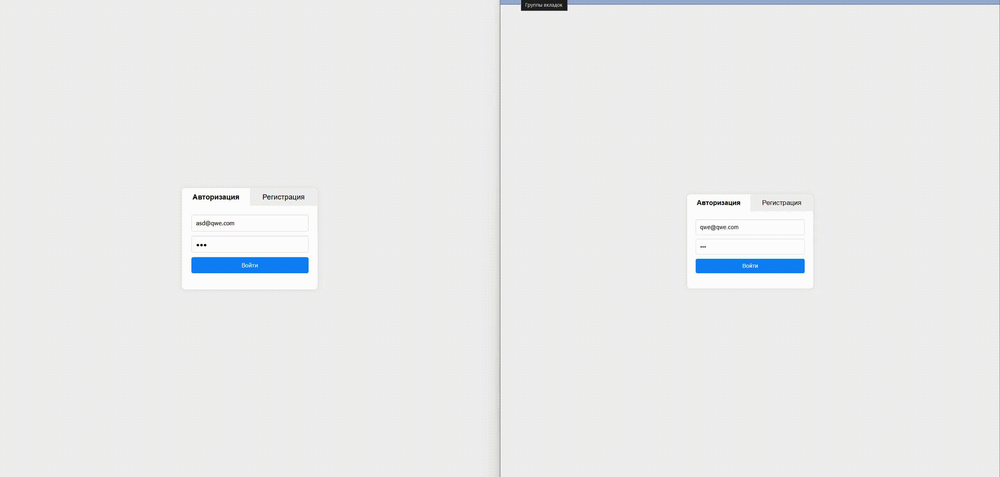

# Веб чат в реальном времени на FastApi.

Данный проект представляет собой мини-чат с использованием FastAPI для создания API,
**SQLAlchemy** для работы с базой данных и простого фронтенда для взаимодействия с пользователями.
Приложение содержит две основные модели: модель пользователей и модель сообщений, что позволяет
пользователям отправлять и получать сообщения в реальном времени.

## Стек технологий:
- **Backend**: FastAPI
- **Frontend**: HTML/JavaScript
- **ORM**: SQLAlchemy
- **База данных**: PostgreSQL 

## Функционал:
Это веб-приложение для обмена сообщениями, в котором пользователи могут отправлять и получать сообщения в реальном времени. Основные возможности включают:

1. **Аутентификация**: Регистрация и авторизация пользователей через формы на HTML и JavaScript. Используются API для обработки и валидации данных.
2. **Чат**: Пользователи могут выбирать собеседников из списка и общаться с ними. Сообщения отображаются в окне чата.
3. **Отправка сообщений**: Пользователи могут отправлять текстовые сообщения. Для мгновенной доставки сообщений используется WebSocket. Старые сообщения подгружаются при помощи опроса сервера.
4. **Интерфейс**: Современный и адаптивный интерфейс с использованием CSS, обеспечивающий удобное взаимодействие на различных устройствах.
5. **Управление пользователями**: Возможность выбора собеседников, выхода из системы.

## Пример GIF-анимации

Ниже представлена анимация, демонстрирующая процесс работы приложения:



## Как запустить проект

### Установка зависимостей:

```bash
pip install -r requirements.txt
```

### Выполнение миграций Alembic:

```bash
alembic upgrade head
```
### Запуск проекта:
```bash
uvicorn main:app
```

### Участники проекта
* [skkqz](https://github.com/skkqz/)

Вы можете внести свой вклад в этот проект, создавая issues или pull requests.